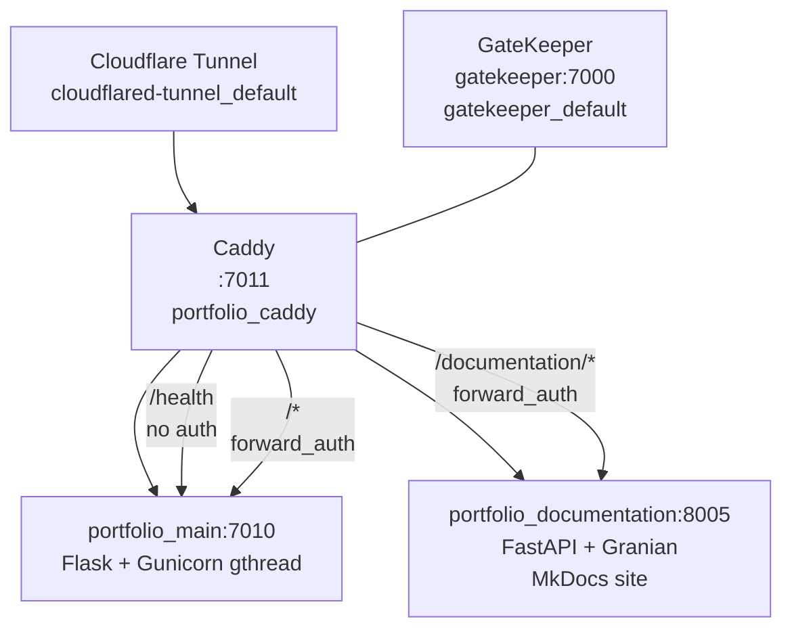

# Portfolio

Personal portfolio site built with **Flask 3.1 + Gunicorn**, served behind a **Caddy** reverse proxy that gates access through [GateKeeper](https://github.com/NovaProtocol/GateKeeper). It documents every project in the stack — detail pages, tech tags, live-site embeds with online/offline status, and a print-ready resume.

**Stack:** Python 3.14 + Flask 3.1 + Gunicorn (gthread) + Caddy 2-alpine
**Docs:** MkDocs Material at `documentation/` (this site, served by FastAPI + granian on `:8005`)

## Services Overview

| Service | Container | Internal Port | Caddy Route | Network |
|---------|-----------|---------------|-------------|---------|
| **App** | `portfolio_main` | 7010 (gunicorn) | `/*` via `:7011` | default |
| **Documentation** | `portfolio_documentation` | 8005 (granian) | `/documentation/*` via `:7011` (gated) | default |
| **Caddy** | `portfolio_caddy` | 7011 | — | default, gatekeeper, cloudflared-tunnel |
| **GateKeeper** | `gatekeeper` (external) | 7000 | `forward_auth` | gatekeeper_default |

- Caddy listens on `:7011` (loopback-only publish `127.0.0.1:7011:7011`), reachable publicly via the Cloudflare tunnel.
- `/health` bypasses the gate for uptime probes; every other path requires a valid `gatekeeper_token` cookie or `?access_code=` magic link.
- Docs are **gated** — same `forward_auth` as the app — at `/documentation/*` via `handle_path` (prefix stripped).

## How It Works



Request → Caddy `:7011` → `forward_auth gatekeeper:7000 { uri /api/authz/forward-auth }` → `200` → `reverse_proxy` to the target. Without a cookie or valid `?access_code=`, GateKeeper returns `302` to the login page; the code flow sets an apex cookie and strips the param.

## Quick Links

| Link | Description |
|------|-------------|
| [Getting Started](getting-started.md) | Prerequisites, env vars, dev vs Docker |
| [Architecture](architecture.md) | App factory, config, request flow, blueprints |
| [Home Blueprint](blueprints/home.md) | `/` and `/health` |
| [Projects Blueprint](blueprints/projects.md) | `/projects/` listing and `/projects/info/<slug>/` |
| [Resume Blueprint](blueprints/resume.md) | `/resume/` and `/resume/view` (themes, print) |
| [Templates & Static](templates-static.md) | Jinja2 inheritance and static assets |
| [Docker & Deployment](docker.md) | Compose, Dockerfile, Caddyfile, networks |
| [Why No gRPC](why-no-grpc.md) | Single-service rationale — no internal RPC |

## Project Map

```
Portfolio/
├── run.py                      # dev entrypoint (DEBUG only)
├── wsgi.py                     # gunicorn target wsgi:app
├── apps/
│   ├── __init__.py             # create_app() factory + ProxyFix + blueprints
│   ├── config.py               # Base/Debug/Production + config_dict
│   ├── tags.py                 # tech tag helpers
│   ├── templates/base.html     # shared Jinja2 base
│   ├── home/                   # blueprint ""  → / and /health
│   ├── projects/               # blueprint /projects → index + detail
│   └── resume/                 # blueprint /resume → index + /view (themes)
├── static/                     # served at /static (images, js demos)
├── data/resume.json            # resume content
├── caddy/Caddyfile + Dockerfile
├── documentation/              # MkDocs site (this site) on :8005
├── compose.yaml                # app + caddy + documentation
├── Dockerfile                  # python:3.14-slim → gunicorn wsgi:app
├── requirements.txt            # flask, gunicorn
└── pyproject.toml              # ruff, mypy, yamllint
```

## Design Language

Informational / portfolio content with a clean, professional presentation. No app-shell portals — content-driven pages using the house base template and static assets.

## Ports

| Port | Service | Publish |
|------|---------|---------|
| 7010 | App (gunicorn, internal) | not published — via Caddy |
| 7011 | Caddy | `127.0.0.1:7011:7011` (loopback, tunnel only) |
| 8005 | Documentation (granian, internal) | `expose:` only — via Caddy `/documentation/*` |

Ports are allotted in groups of 10 — Portfolio owns the **7010** block.
