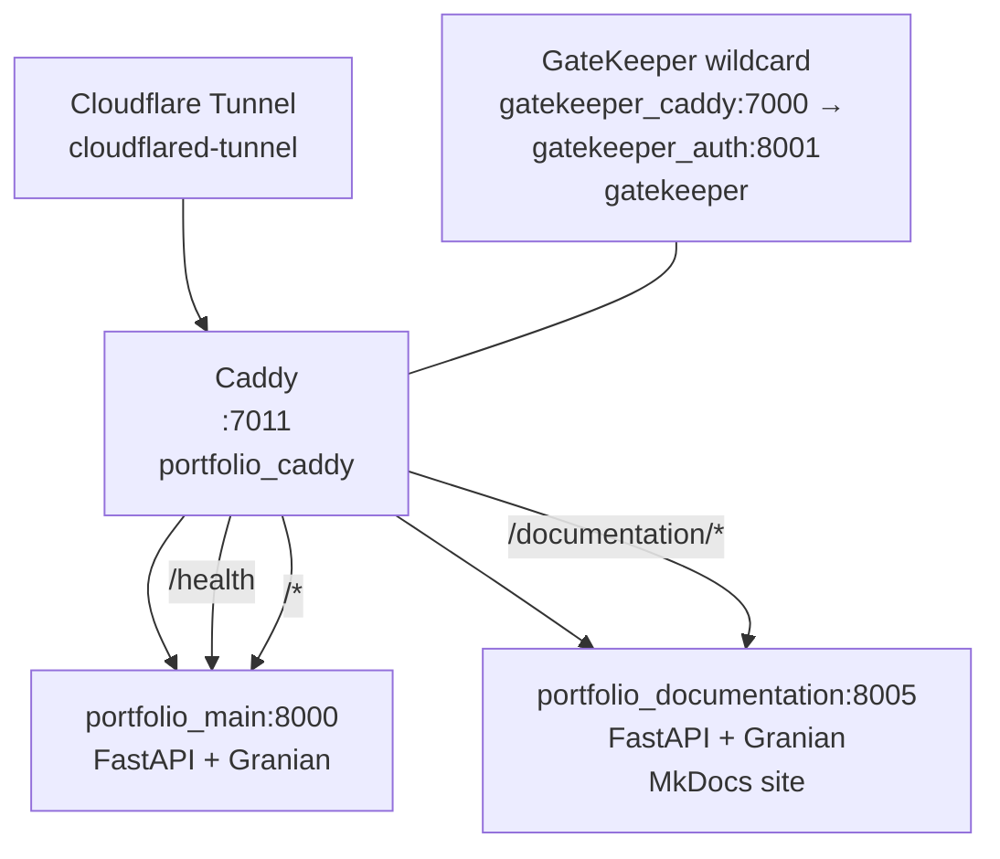

# Portfolio

Personal portfolio site built with **Python 3.14 + FastAPI + Granian + Jinja2**, served behind a **Caddy** reverse proxy that gates access through [GateKeeper](https://github.com/NovaProtocol/GateKeeper). It documents every project in the stack with detail pages, tech tags, live-site embeds with online/offline status, and a print-ready resume.

**Stack:** Python 3.14 + FastAPI + Granian + Jinja2 + Caddy 2-alpine
**Docs:** MkDocs Material at `documentation/` (this site, served by FastAPI + granian on `:8005`)

## Services Overview

| Service | Container | Internal Port | Caddy Route | Network |
|---------|-----------|---------------|-------------|---------|
| **App** | `portfolio_main` | 8000 (granian) | `/*` via `:7011` | default |
| **Documentation** | `portfolio_documentation` | 8005 (granian) | `/documentation/*` via `:7011` | default |
| **Caddy** | `portfolio_caddy` | 7011 | n/a | default, gatekeeper |

- Caddy listens on `:7011` (loopback-only publish `127.0.0.1:7011:7011`), reachable publicly via the Cloudflare tunnel on `gatekeeper`.
- Gate is at the **wildcard** (`gatekeeper_caddy:7000` → `gatekeeper_auth:8001` on `gatekeeper`). Local `caddy/Caddyfile` proxies without a per-app `GateKeeper gate` (wildcard per `reference/gatekeeper/caddy-setup.md`).
- `/health` is the liveness probe; gated paths enforce `gatekeeper_token` / `?access_code=` at the wildcard.

## How It Works



Request → `portfolio_caddy:7011` → `reverse_proxy` to `portfolio_main:8000` / `portfolio_documentation:8005`. When fronted by the wildcard, GateKeeper enforces `GET /api/authz/forward-auth` before Caddy proxies; without a cookie or valid `?access_code=`, GateKeeper returns `302` to login and the flow sets an apex `gatekeeper_token` and strips the param.

## Quick Links

| Link | Description |
|------|-------------|
| [Getting Started](getting-started.md) | Prerequisites, env vars, dev vs Docker |
| [Architecture](architecture.md) | App factory, config, request flow, blueprints |
| [Home Blueprint](blueprints/home.md) | `/` and `/health` |
| [Projects Blueprint](blueprints/projects.md) | `/projects/` listing and `/projects/info/<slug>/` |
| [Resume Blueprint](blueprints/resume.md) | `/resume/`, `/resume/view` (themes, print), noindex (`/robots.txt` is served by GateKeeper) |
| [Templates & Static](templates-static.md) | Jinja2 inheritance and static assets |
| [Docker & Deployment](docker.md) | Compose, Dockerfile, Caddyfile, networks |

## Project Map

```
Portfolio/
├── run.py # dev entrypoint (argparse, granian/uvicorn)
├── wsgi.py # ASGI target wsgi:app (FastAPI)
├── apps/
│ ├── __init__.py # create_app() factory + ProxyFix + blueprints
│ ├── config.py # Base/Debug/Production + config_dict
│ ├── tags.py # tech tag helpers
│ ├── templates/base.html # shared Jinja2 base
│ ├── home/ # blueprint "" → / and /health
│ ├── projects/ # blueprint /projects → index + detail
│ └── resume/ # blueprint /resume → index + /view (themes)
├── static/ # served at /static (images, js demos)
├── data/resume.json # resume content
├── caddy/Caddyfile + Dockerfile
├── documentation/ # MkDocs site (this site) on :8005
├── compose.yaml # app + caddy + documentation
├── Dockerfile # python:3.14-slim → granian wsgi:app on :8000
├── requirements.txt # fastapi, granian, jinja2
└── pyproject.toml # ruff, mypy, yamllint
```

## Design Language

Informational / portfolio content with a clean, professional presentation. There are no app-shell portals, only content-driven pages using the house base template and static assets.

## Ports

| Port | Service | Publish |
|------|---------|---------|
| 8000 | App (granian, internal) | not published, served via Caddy `portfolio_main:8000` |
| 7011 | Caddy | `127.0.0.1:7011:7011` (loopback, tunnel only) |
| 8005 | Documentation (granian, internal) | `expose:` only with access via Caddy `/documentation/*` |

Ports are allotted in groups of 10, and Portfolio owns the **7010** block.
